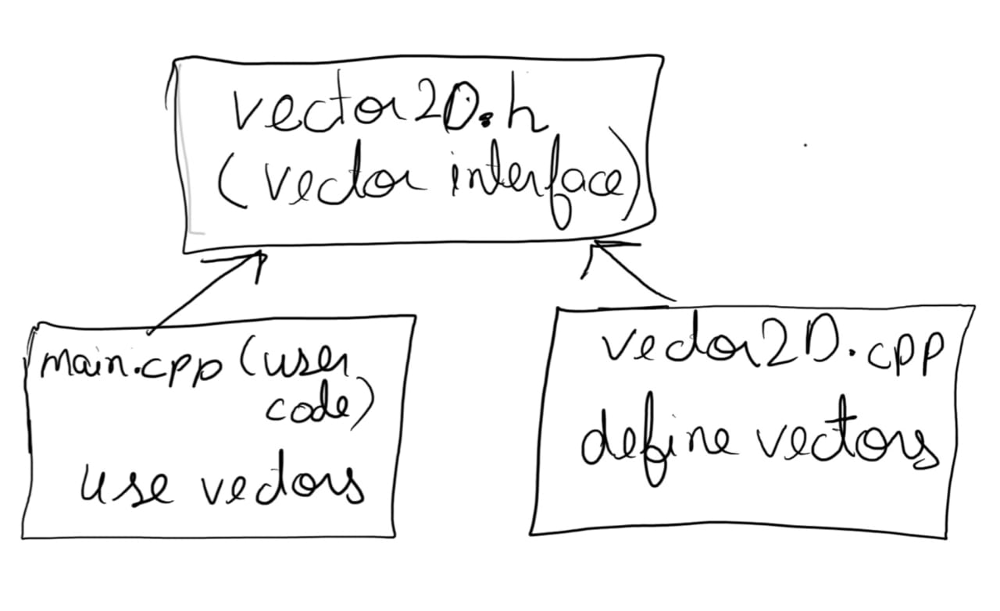

#### Quick recap
- Compilation Process
---
#### Agenda
- Layered Architecture
- Procedural vs Modular vs OOPs
- 
---
### Layered architecture

---
### Themes of this course

|     | Themes                                          | Topics                      |
| --- | ----------------------------------------------- | --------------------------- |
|     | **Programming Environment**                     | Compilation process         |
|     | **Programming Languages/ Programming concepts** | Programming paradigms, OOPs |
|     | **Specific programming language C/C++**         | syntax, features            |

---
#### Programming Paradigms
- Procedural programming
- Modular programming
- Object Oriented Programming
- Generic Programming
---

#### Procedural Programming

> Decide which procedures you want;
> Use the best algorithms you can find.

- Language supports this paradigm by providing facilities for passing arguments to functions and returning values from functions.  

Refer code: [[vector2d_struct.c]]

---
#### Scope of improvement(1)
 1. [**namespace pollution**](https://cpp-primer.pages.dev/book/172-18.2._namespaces.html#filepos4928745) Occurs when all the names of classes and functions are placed in the global namespace. Large programs that use code written by multiple independent parties often encounter collisions among names if these names are global.
 2. Separation of concern: User code is not separated from 

---
#### Modular programming

> Decide which modules you want;
> partition program so that data is hidden within modules.

---
#### Namespaces
**[Namespaces](https://cpp-primer.pages.dev/book/175-defined_terms.html#filepos5111084)** provide a much more controlled mechanism for preventing name collisions. Namespaces partition the global namespace. A namespace is a scope. By defining a library’s names inside a namespace, library authors (and users) can avoid the limitations inherent in global names.

---
#### Multi-file compilation
C++ like C supports C"s notion of separate compilation. This can be used to organise a program into a set of semi-independent fragments.

---

#### Object Oriented Programming

---

#### References
1. [Chapter 3: C++ Programming Language - Bjarne Stroustrup]()
2. 
